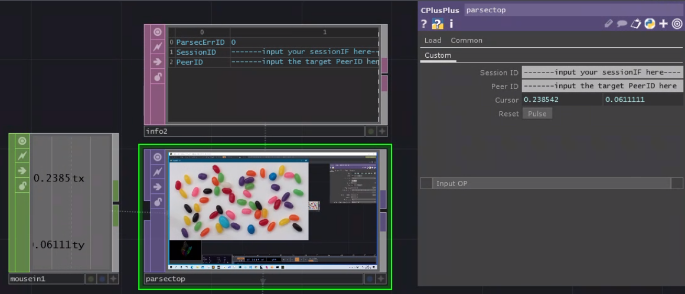

# ParsecTOP
Parsec texture streaming client operator for TouchDesigner. Build with CPulsPuls Operator. Based on [parsec-cloud/parsec-sdk](https://github.com/parsec-cloud/parsec-sdk).

> tested in TouchDesigner 2020.26630

## Setting up Parsec

You need a Parsec account. Go [https://parsecgaming.com/](https://parsecgaming.com/) to create an acount and download Parsec App. 

> Note that only [Windows 10 with some hardware requirements](https://support.parsecgaming.com/hc/en-us/articles/115002699192-Hardware-Requirements-For-Hosting-A-Gaming-Session-On-Parsec) can be the host (the source computer of streaming texture).

## login to Parsec API to get session_id

A sessionID and PeerIDs are required to establish Parsec stream session. To get those IDs, use personal_api_parsec-sdk/login.py. For the detail, please refer [this](https://github.com/parsec-cloud/parsec-sdk/tree/master/api/personal). 

> Note that in the original [sdk script](https://github.com/parsec-cloud/parsec-sdk/tree/master/api/personal), API_HOST URL was not updated, and I modified the HOST as '[https://kessel-api.parsecgaming.com/](https://kessel-api.parsecgaming.com/)'.

```jsx
cd personal_api_parsec-sdk
python login.py
```

then input your email and password. (You might need error at the first attempt, and required to validate the access via the received email from parsec. ) Then you will get a `session_id` and a `host_peer_id`; those are sensitive information then do not share with others.

example:

```jsx
{"instance_id":"","user_id":999999999,"session_id":"XXXXXXXXXXXXXXX**872ff21f53a52757399594d5aXXXXXXXXXXXX**","host_peer_id":"1jOuXXXXXXXXXXXXXXXXXXx5je"}
```

To get the list of available host computers, run `python host.py` , then you'll get like

```jsx
> python host.py

NAME                 PEER_ID
----                 -------
COMPUTER1            host_peer_idXXXXXXXXXXXXXX
COMPUTER2            host_peer_idYYYYYYYYYYYYYY
```

Then, now you have 2 ids( `session_id` and `host_peer_id`) which you will use in ParsecTOP in TouchDesigner.

## ParsecTOP in TouchDesigner

Open `parsecTOP_client_test.toe` and you will see the parsectop (CPulsPuls Operator). Open the parameter window and input your session_id and host_peer_idm then hit `Reset` button. Additionally, you can also send the cursor position via Cursorx, Cursory. 

( I might update clink information later soon)




## known issue

TouchDesigner global framerate will be limited to the received parsec texture stream frame-rate which is automatically adjusted to the screen update of the host screen. Thus, please make sure that the screen graphics are displayed and updated in the required frame-rate such as 60Fps in the host computer. Just for example, you can run host_test_visual.toe on the host side computer.
